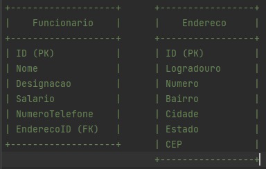

# Projeto de Gestão de Funcionários

Este é um projeto simples de gerenciamento de funcionários desenvolvido em Java. O objetivo deste projeto é fornecer um sistema para adicionar, consultar, atualizar e excluir funcionários.

**Requisitos**

Java 8 ou superior

**Funcionalidades**

* Adicionar novos funcionários com informações como nome, designação, salário, número de telefone e endereço.
* Obter detalhes dos funcionários existentes pelo seu ID.
* Atualizar os detalhes dos funcionários existentes.
* Excluir funcionários existentes pelo seu ID.

**Design e Implementação**

* O sistema utiliza uma classe Funcionario para representar as informações de um funcionário, incluindo seus atributos e métodos.
* A classe FuncionarioService é responsável por gerenciar os funcionários e utiliza um HashMap para armazenar os detalhes dos funcionários em memória.
* A interface FuncionarioAPI define os contratos da API que são implementados pela classe FuncionarioAPIImpl. Nessa implementação, os métodos são responsáveis por interagir com o FuncionarioService e realizar as operações de gerenciamento de funcionários.
* O sistema não possui uma camada web ou similar, sendo focado apenas nos serviços e na API.

**Como executar o projeto**

* Certifique-se de ter o Java JDK 8 ou superior instalado na sua máquina.
* Baixe o código-fonte do projeto ou clone este repositório.
* Compile o código-fonte usando o comando: `javac *.java`
* Execute o projeto usando o comando: `java Main`

**Exemplo de Uso**

`public static void main(String[] args) {`

    FuncionarioAPI funcionarioAPI = new FuncionarioAPIImpl();
    Funcionario func1 = new Funcionario(1, "João", "Analista", 3500.0, "111111111", "Rua A");
    Funcionario func2 = new Funcionario(2, "Maria", "Gerente", 5000.0, "222222222", "Rua B");

    funcionarioAPI.adicionarFuncionario(func1);
    funcionarioAPI.adicionarFuncionario(func2);

    Funcionario funcObtido = funcionarioAPI.obterFuncionario(1);
    System.out.println("Detalhes do funcionário 1: " + funcObtido);

    func1.setSalario(4000.0);
    funcionarioAPI.atualizarFuncionario(func1);

    funcionarioAPI.excluirFuncionario(2);
`}`

**Considerações**

Este projeto é apenas um exemplo didático e não possui uma camada web ou persistência real dos dados. Você pode expandir e aprimorar o projeto para atender às necessidades do seu cenário específico. Sinta-se à vontade para contribuir ou adaptar o código conforme necessário.

**Diagrama de Tabelas**

